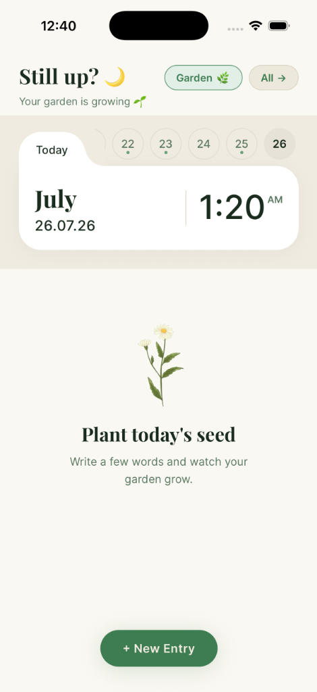
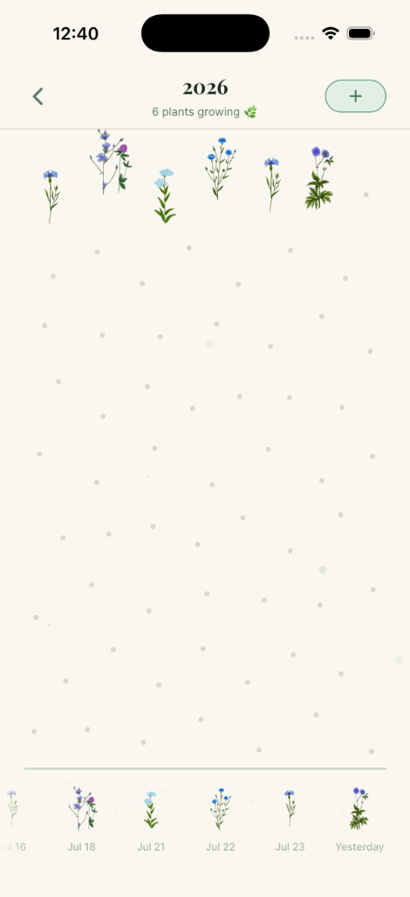
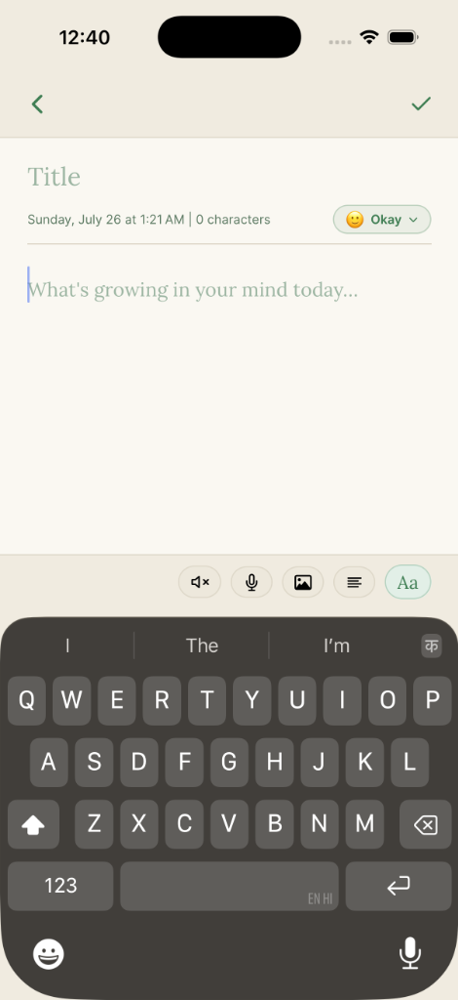
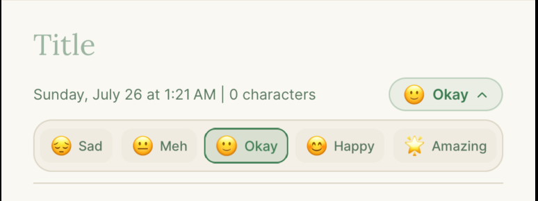
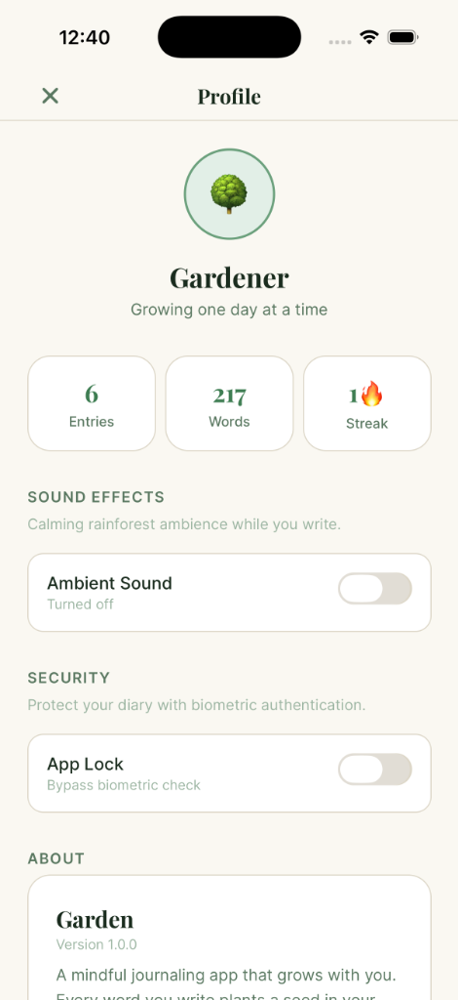

# Garden 🌿

Garden is a beautiful, distraction-free daily note-taking and journaling application built with React Native and Expo. Instead of just logging text, Garden turns your thoughts, moods, and reflections into a growing virtual garden.

---

## 📱 App Overview & Screenshots

| Home Screen | Virtual Garden View |
| :---: | :---: |
|  |  |
| **Plant Today's Seed**<br/>Intuitive date strip navigation, quick time badge, and one-tap entry creation. | **Visual Habit Growth**<br/>Watch your entries blossom into a serene field of unique plants as you maintain your journaling habit. |

| Note Editor | Mood Tracking | Profile & Settings |
| :---: | :---: | :---: |
|  |  |  |
| **Mindful Writing Space**<br/>Rich editor with font choices, ambient audio, list formatting, image attachments, and voice notes. | **Emotion Tagging**<br/>Inline mood selector to track your feelings alongside your thoughts. | **Gardener Stats & Security**<br/>Track entry counts, word totals, daily streaks, ambient sound toggles, and biometric lock. |

---

## 📖 Use Case

In today's fast-paced world, maintaining a daily journaling habit can feel like a chore. Garden gamifies the experience of self-reflection. Every time you write an entry, you plant a "seed" that blossoms into a unique plant in your virtual garden. 

Whether you want to track your daily mood, jot down quick ideas, or write extensive daily reflections, Garden provides a peaceful environment to do so. Over time, your consistent habit visually manifests into a dense field of plants, rewarding you for your dedication to logging your days.

---

## ✨ Key Features

- 🌿 **The Virtual Garden**: Every entry you complete grows a unique flower or plant in your visual garden layout. Track your writing consistency as your garden flourishes over the years.
- 📝 **Mindful Note Editor**: Distraction-free writing environment supporting custom typography, per-paragraph text alignment, and bulleted, numbered, or lettered lists.
- 🎭 **Mood Tracking**: Express how you feel by tagging entries with intuitive mood selectors (Sad 😔, Meh 😐, Okay 🙂, Happy 😊, Amazing 🌟).
- 🔊 **Calming Ambient Audio**: Built-in nature & rainforest soundscapes that play while you write to keep you focused and grounded.
- 🎙️ **Voice & Image Attachments**: Attach photos or record voice notes directly within your journal entries.
- 📊 **Gardener Profile & Stats**: Keep track of total entries written, total word counts, and your current daily streak counter.
- 🔒 **Biometric Security**: Protect your private diary entries with device App Lock (Face ID / Touch ID / Passcode).
- 🎨 **Typography Customization**: Choose from curated serif and sans-serif fonts to personalize your writing interface.

---

## 🛠 Tech Stack

- **Framework**: [React Native](https://reactnative.dev/) with [Expo Router](https://docs.expo.dev/router/introduction/)
- **Animations & Sound**: React Native Reanimated & Expo AV
- **Authentication**: Expo LocalAuthentication (Biometrics)
- **Media**: Expo ImagePicker & Expo AV Recording
- **Storage**: AsyncStorage (`@react-native-async-storage/async-storage`)
- **Typography**: Expo Google Fonts (`Crimson Pro`, `Inter`, `Lora`, `Nunito`, `Playfair Display`)

---

## 🚀 Getting Started

### Download the App (Android)

If you want to install and try the app on your Android device, you can download the `.apk` file directly from our **[GitHub Releases](../../releases)** page.

1. Download the latest `Garden.apk` file to your phone.
2. Tap the file to install it (allow "Install from unknown sources" in settings if prompted).

### Development Setup

#### Prerequisites

Ensure you have [Node.js](https://nodejs.org/) installed, along with either the Expo Go mobile app or an iOS/Android simulator setup.

#### Local Installation

1. Clone the repository and navigate to the project directory:
   ```bash
   cd Garden
   ```

2. Install dependencies:
   ```bash
   npm install
   ```

3. Start the Expo development server:
   ```bash
   npm start
   ```

4. Press `i` to open in an iOS simulator, `a` for an Android emulator, or scan the QR code with the Expo Go app on your physical device.

---

*Your garden is growing 🌱*
